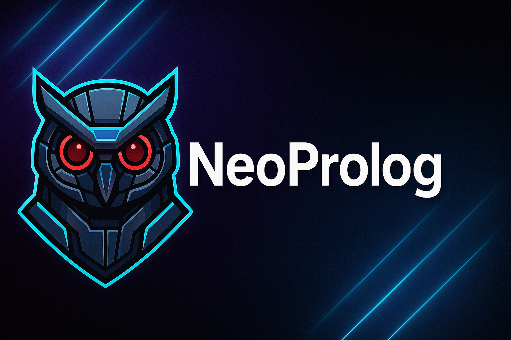

# 🦉 NeoProlog

**NeoProlog** is a modern logic programming interpreter based on **classical predicate calculus**, combining the ancient powers of Prolog with today's shiny tech toys ⚡️.  
The project is split into two halves:

---

## 🧠 Interpreter Core

Written in **C++** for **raw performance**, because logic deserves speed.  
This core packs:

- 🧬 Unification engine  
- 🔄 Backtracking like it's 1983  
- 🛠️ A basic parser that gets the job done (for now...)

---

## 🌐 Web Interface

Built with **Ruby on Rails**, because:

- 🕸️ Web is king  
- 🧑‍💻 Browsers are everywhere  
- 😎 And let’s be honest... Rails makes life easier

You get an **easy-to-use**, clean interface without writing native apps for every platform  
or hoping they compile on windows .

---

## 🤔 Why? And why this way...?

### ❓ Why?

Because most university syllabi still teach Prolog like it’s 1999 💾,  
and the tools haven’t been updated since then.  
You end up using software that looks like it runs on a microwave ☢️.

**So we made a new one.** One that doesn’t feel like punishment 🧘‍♂️.

---

### ⚙️ Why this way?

- 🚂 **Rails** means less boilerplate, more velocity  
- 🌍 Runs in any modern browser – even your smart fridge, probably  
- 📦 No native builds, no OS drama, no tears  
- 🦾 **C++** gives us speed, control, and the undeniable right to say  
  *“we care about performance”* during tech interviews

---
### 🔧Tech stack
 - Ruby On Rails
 - SQLite
 - C++

---
> TL;DR: NeoProlog is like SWI-Prolog had a baby with RoboCop 🤖🦉  
> ...and it runs in your browser.  
> You're welcome 💻🔥

---
